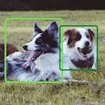

# Mi Resumen de GitHub

## ¡Bienvenidos a mi mundo tecnológico!

¡Hola, soy Angello Lopez, y estoy emocionado de compartir mis proyectos y exploraciones en robótica e inteligencia artificial contigo!

## Proyectos Destacados

### Proyecto de Clasificación de Animales
![Imagen del proyecto de Asistente Personal de IA]

Este proyecto utiliza redes neuronales convolucionales para aprender a reconocer perros y gatos.

### Proyecto de Asistente Personal de IA

Este proyecto utiliza técnicas avanzadas de aprendizaje profundo y procesamiento del lenguaje natural para crear un asistente personal que puede realizar una variedad de tareas útiles para el usuario.

### Plataforma de Robotica Modular

Mi equipo está construyendo una plataforma modular de robótica que permite a los desarrolladores crear robots personalizados con facilidad.

### Red Neuronal de Diagnóstico Médico

Utilizando grandes conjuntos de datos de diagnóstico médico, estamos construyendo una red neuronal que puede diagnosticar enfermedades con mayor precisión que los médicos humanos.

## Contribuciones y Eventos

¡Únete a nuestra comunidad y sé parte del futuro de la tecnología! Estamos constantemente buscando contribuciones a nuestros proyectos y organizamos eventos regulares para que los desarrolladores y expertos en tecnología se reúnan y discutan las últimas tendencias en robótica e inteligencia artificial.

### ¡Únete a nosotros!

¡Únete a nosotros en el mundo de la robótica y la inteligencia artificial! ¡Juntos podemos crear un futuro mejor! 🤖🚀
